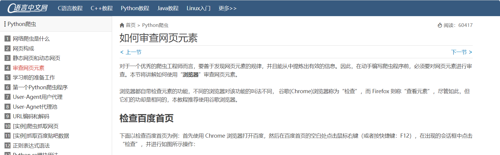
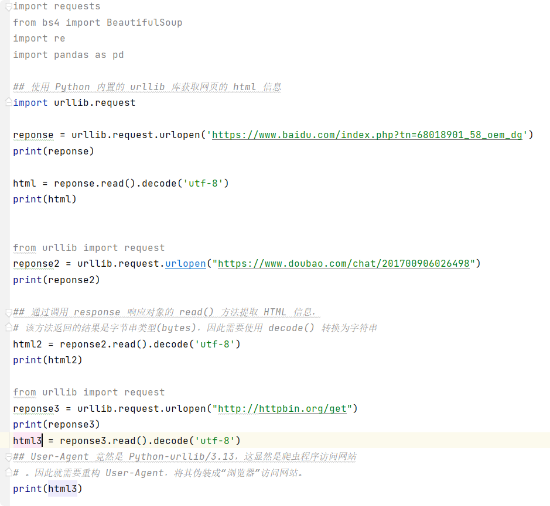
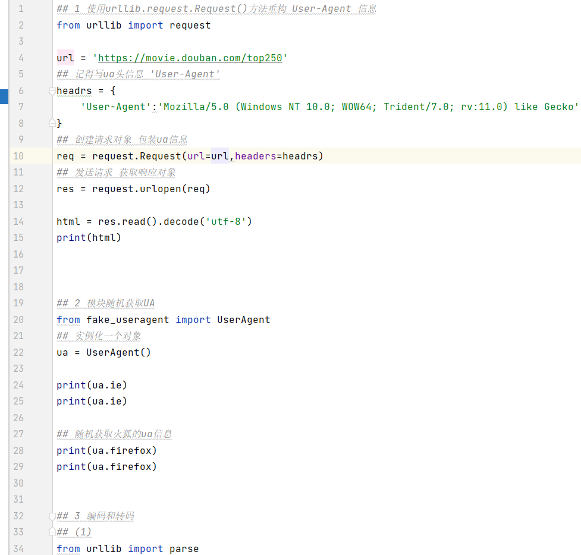

9.22日 韩天昊
## python 爬虫入门
爬虫是什么
网络爬虫又称网络蜘蛛、网络机器人，
它是一种按照一定的规则自动浏览、检索网页信息的程序或者脚本。
网络爬虫能够自动请求网页，并将所需要的数据抓取下来。
通过对抓取的数据进行处理，从而提取出有价值的信息。

下面是我学习python 爬虫的网站
https://c.biancheng.net/python_spider/check-element.html
目前学习到第10个目录，目标是四天或五天将网站教程练完

还有我照着网站上的教程写的代码

1

2

