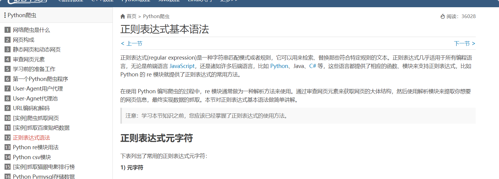
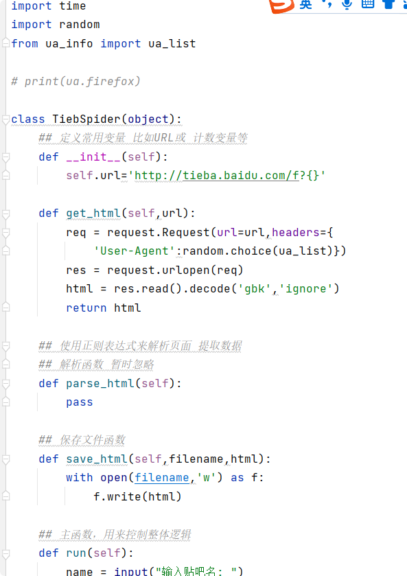
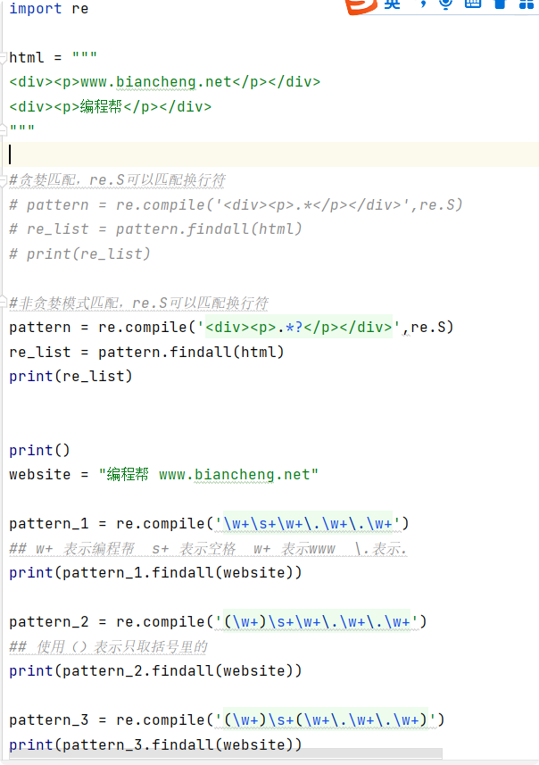

9.23日 韩天昊
## python 爬虫入门2

正则表达式(regular expression)是一种字符串匹配模式或者规则，
它可以用来检索、替换那些符合特定规则的文本。正则表达式几乎适用于所有编程语言，
无论是前端语言 JavaScript，还是诸如许多后端语言，比如 Python、Java、C# 等，
这些语言都提供了相应的函数、模块来支持正则表达式，
比如 Python 的 re 模块就提供了正则表达式的常用方法。

在使用 Python 编写爬虫的过程中，re 模块通常做为一种解析方法来使用。
通过审查网页元素来获取网页的大体结构，然后使用解析模块来提取你想要的网页信息，
最终实现数据的抓取。本节对正则表达式基本语法做简单讲解。

下面是我学习python 爬虫的网站
https://c.biancheng.net/python_spider/check-element.html
目前学习到第19个目录，目标是三天或四天将网站教程练完

还有我照着网站上的教程写的代码

1

2

