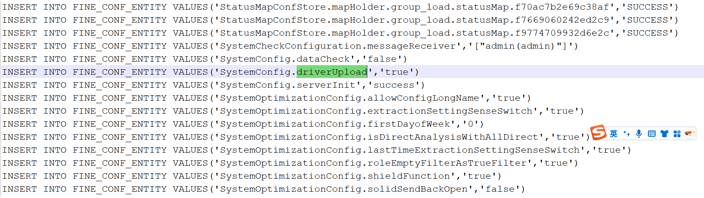

9.25日 韩天昊
## finebi 
因为重新从别人硬盘考了一个finebi，但是
登录不上，所以重新安装了一下finebi

如何自定义驱动

1.先停止FineBI

2.右键图标打开安装目录 寻找FineBIX\webapps\webroot\WEB-INF\embed\finedb，修改db.script文件，添加如下内容

INSERT INTO FINE_CONF_ENTITY VALUES('SystemConfig.driverUpload','true')

如果是

INSERT INTO FINE_CONF_ENTITY VALUES('SystemConfig.driverUpload','false')的话直接改成true。

然后点击「测试连接」，若连接成功则点击「保存」，如下图所示：

