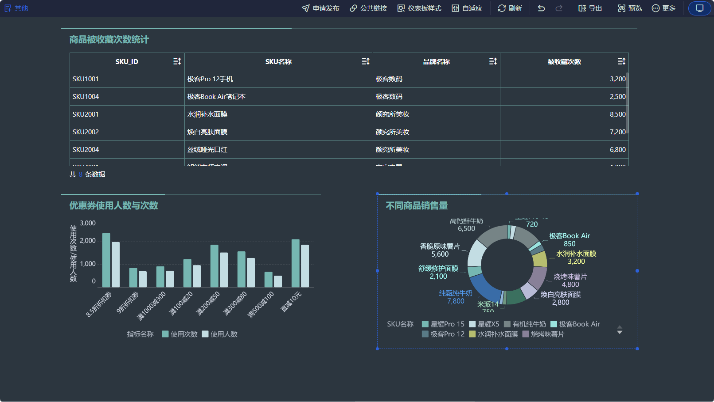
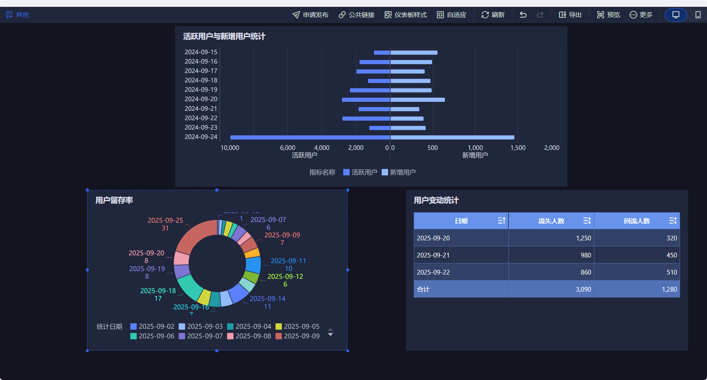

9.26日 韩天昊
## 离线数仓报表

图 1 包含三个部分，上方表格为 “用户支付优惠券支付最近 1 日汇总”，展示了不同类型优惠券（满减券、折扣券、买赠券等）、具体优惠券名称、用户 ID 以及支付次数；左下方折线图是 “用户优惠券支付最近 1 日汇总”，呈现了不同用户（u311 - u315）最近 1 日加购商品件数和加购次数的变化趋势；右下方柱状图为 “优惠券支付最近 1 日汇总”，统计了不同商品（夏季连衣裙、平板、智能手机 A 等）最近 1 日的下单次数、下单件数、下单金额和下单最终金额。

（二）数据分析
从上方表格可见，满减券使用场景较多，如满 500 减 100、满 200 减 50 等，用户 u407 使用满 200 减 50 优惠券支付次数达 4 次，显示出该用户对满减类优惠券的偏好较高。左下方折线图中，用户 u314 加购商品件数和加购次数相对其他用户较高，说明该用户在最近 1 日购物意愿较强。右下方柱状图里，智能手机 A 的下单次数、下单件数、下单金额和下单最终金额均处于较高水平，是优惠券支付场景下的热门商品。

（一）图表内容介绍
图 2 分为上下两部分，上方是 “路径分析”，展示了 2025 - 09 - 18 至 2025 - 09 - 22 期间，用户在 checkout cart、payment checkout、product_list home 等不同页面间的跳转次数；下方是 “各渠道流量统计”，统计了百度、抖音、快手、微信、小红书等渠道的访客人数、会话数、跳出率和会话停留时长。
（二）数据分析
在 “路径分析” 中，product_list home 页面在 2025 - 09 - 18 的跳转次数最多，说明该页面在当天对用户的吸引力较大，可能是商品展示丰富或推荐算法有效。“各渠道流量统计” 里，百度的访客人数和会话数相对领先，但跳出率也较高，需关注百度渠道流量的留存情况；小红书会话停留时长有上升趋势，可探索在小红书渠道进一步优化运营策略，提升用户停留价值。
