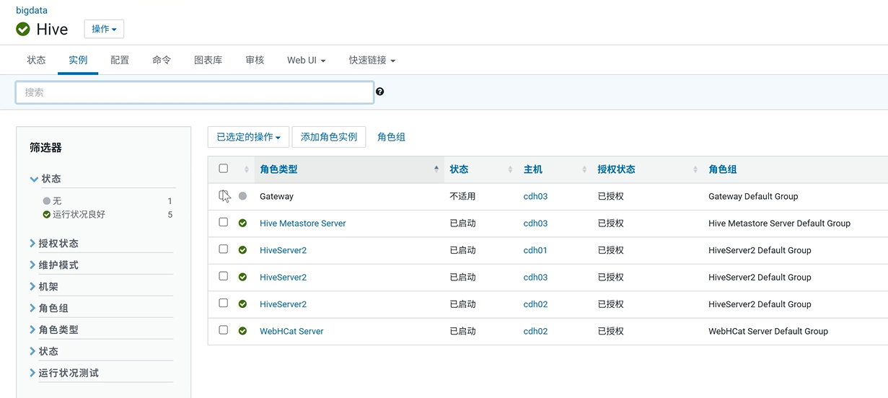
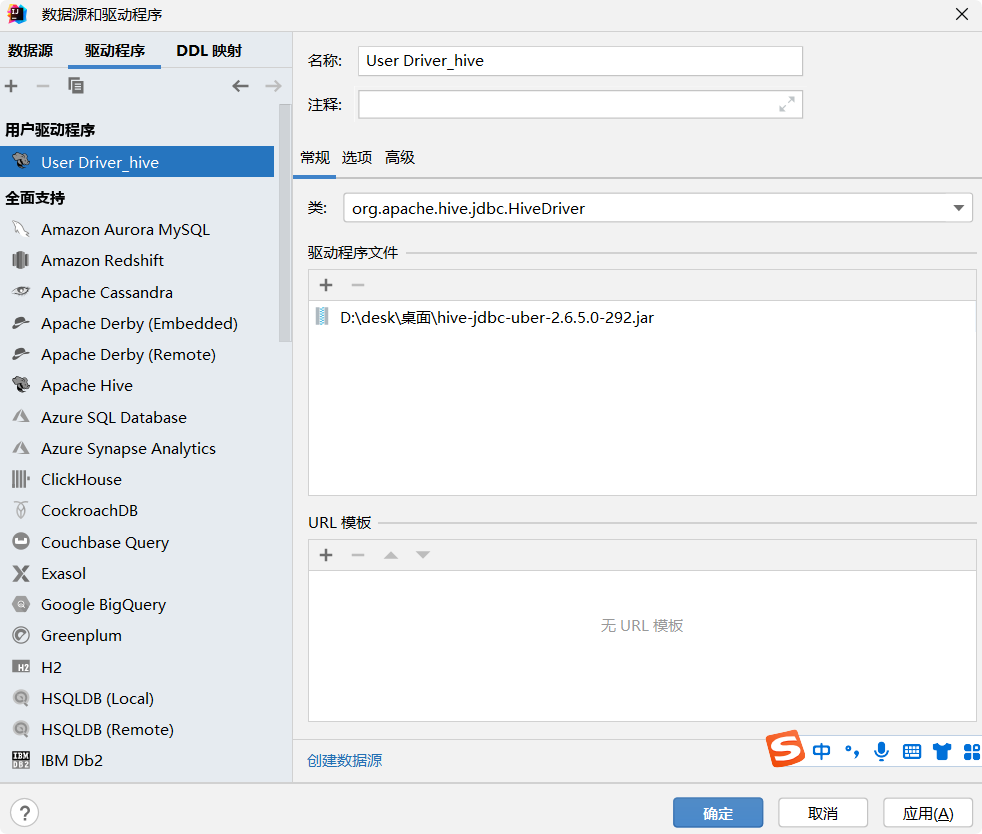
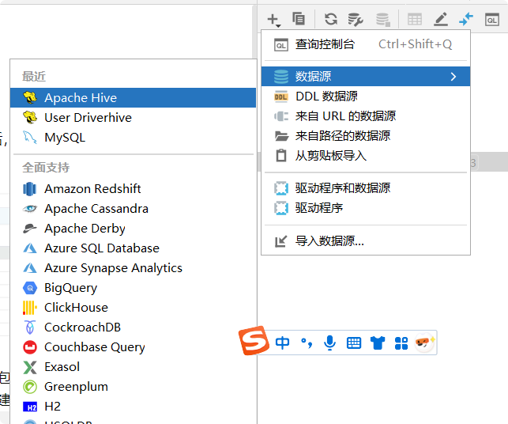
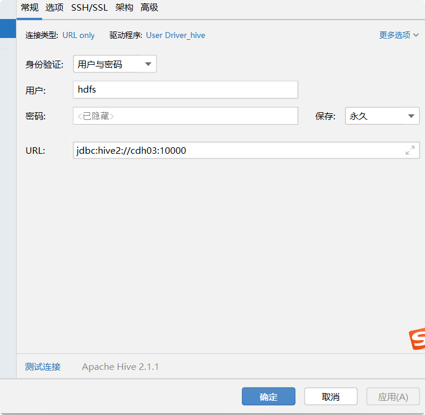

9.15日 韩天昊
## 链接hive
配置完Cloudera Manager集群后，并且链接上hive之后就可以
用idea链接hive数据库了

首先，将老师群里发的hive的jar包下载下来，放到
桌面或者英文目录下，然后可以在idea数据源下创建一个
驱动程序，点创建数据源

然后新建数据源是就可以找到我们新建的数据源，点击配置
就可以测试链接了

将用户和URL地址输入进去，点击测试连接就可以使用
hive，写hiveSQL了
