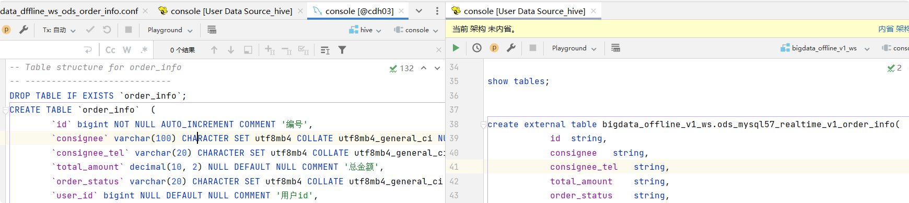
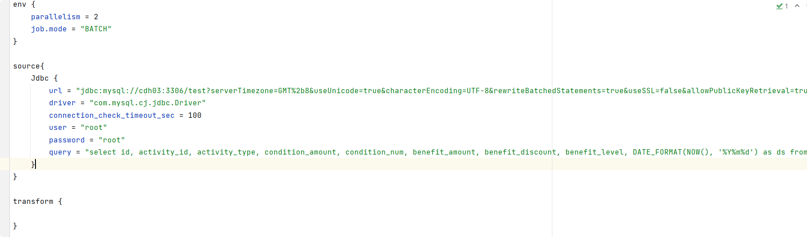
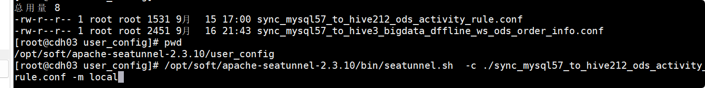
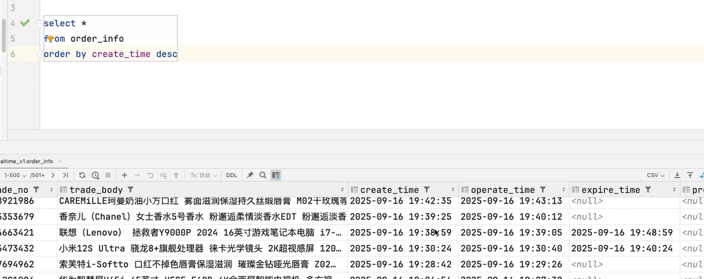

9.16日 韩天昊
## 将mysql的表数据同步到hive当中
首先在mysql和hive中建立一个新的表order_info

在idea新建一个conf文件，文件名要见名知义。
根据老师的范例，修改成自己的用户名，密码，数据库等

在cdh03上创建user_config目录，在此目录下将上一步创建的conf
文件复制过去，然后执行命令，即可

最后执行查询的sql语句，查看是否导入成功

