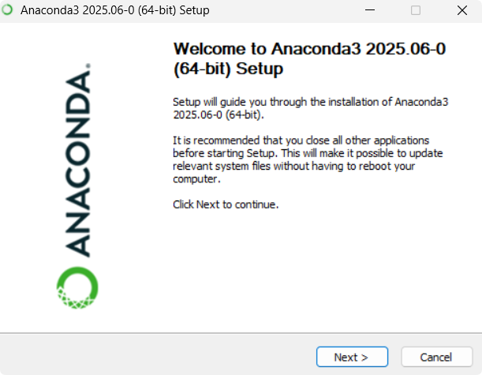
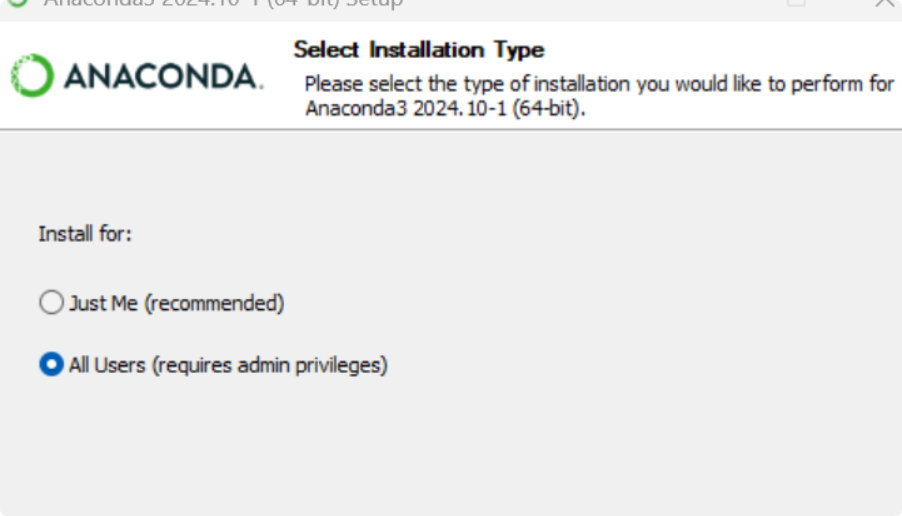
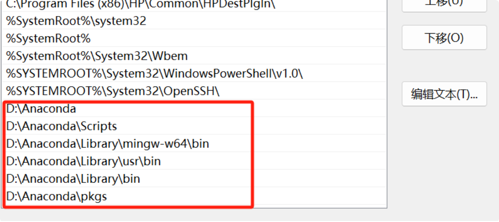

9.19日 韩天昊
## Anaconda3安装
Anaconda的介绍:    
Anaconda 是一款强大的Python包管理和环境管理软件，
能够轻松解决多版本Python 并存、切换及第三方包安装的问题。
它提供了Jupyter Notebook、PyCharm、Spyder等集成开发环境，
并预装了大量科学计算库，如 NumPy、Pandas、Matplotlib 等。
此外，Anaconda 还推出了 Anaconda AI Navigator。

1 首先，找到anaconda的官网，根据操作系统选择合适版本进行下载。
我使用的是 Windows 系统，下载的最新版本链接为：
https://repo.anaconda.com/archive/Anaconda3-2024.10-1-Windows-x86_64.exe。

2 然后将下载包放到桌面 就可以进行安装了

3 注意："just me"选项表示仅对当前用户安装Anaconda，
只有该用户才能使用安装的软件和工具集。这可以使安装过程更快，
同时减少对系统的影响。 "al users"选项表示将Anaconda安装到计算机上的所
有用户都可以使用。这意味着软件和工具集将对每个用户帐户进行安装，
需要更长的安装时间和更多的磁盘空间。

4 配置系统环境变量 （1）在电脑设置搜索栏中搜索“高级系统设置”，并选择“环境变量”，
（2）在“系统变量”中找到“Path”，双击进入。
（3）点击“新建”，并添加 Anaconda 的安装路径，内容如下。
（4）完成以上步骤后，在 Windows CMD窗口中（同时按 win + r ，输入cmd），
输入 conda --version，如果显示版本号，则表示安装成功。
