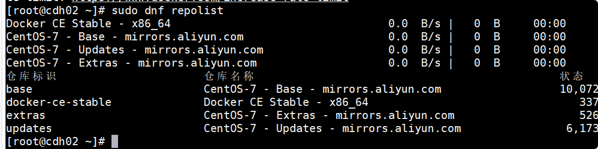

9.20日 韩天昊
## Rocky Linux修改默认源为国内源
1. 备份现有的 YUM 源配置文件
   首先，建议备份现有的 YUM 源配置文件，以防需要恢复：

2. 编辑 YUM 源配置文件
   接下来，你可以编辑 /etc/yum.repos.d/ 目录下的 .repo 文件，或直接替换为其他镜像源。例如，可以将默认的 Rocky Linux 源替换为阿里云源。

替换为阿里云源
首先，删除现有的 .repo 文件（如果需要）
可以用命令sudo rm -f /etc/yum.repos.d/Rocky-*.repo

然后，下载阿里云的 Rocky Linux 源配置文件：

3. 清理缓存并更新软件包索引
   替换完源后，执行以下命令清理缓存并更新软件包索引：

4. 验证源是否已成功更改
   你可以使用以下命令验证新的源是否生效：

